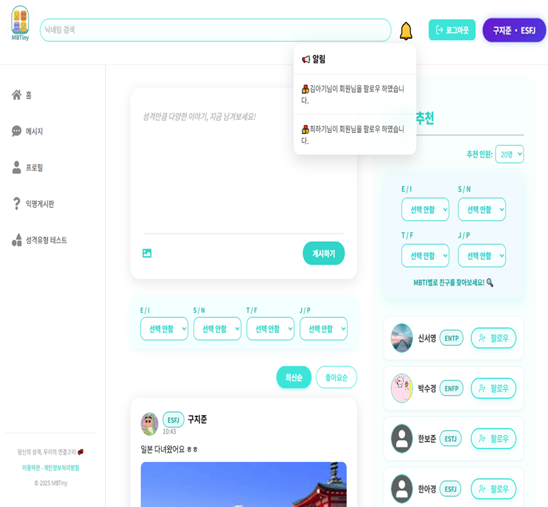
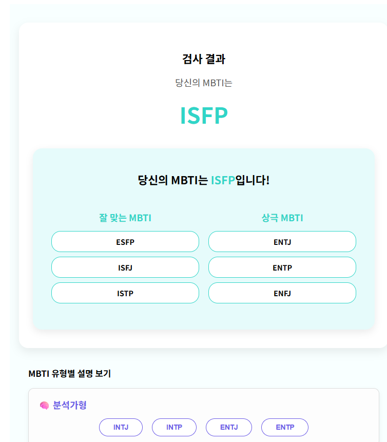
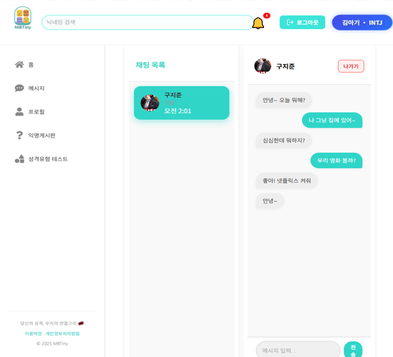
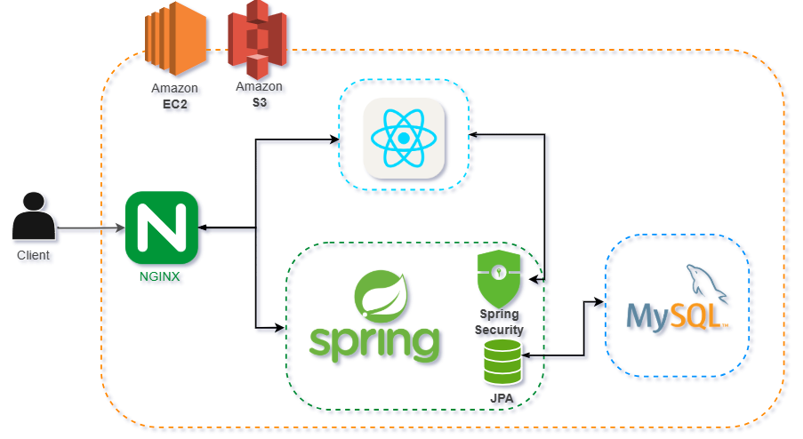
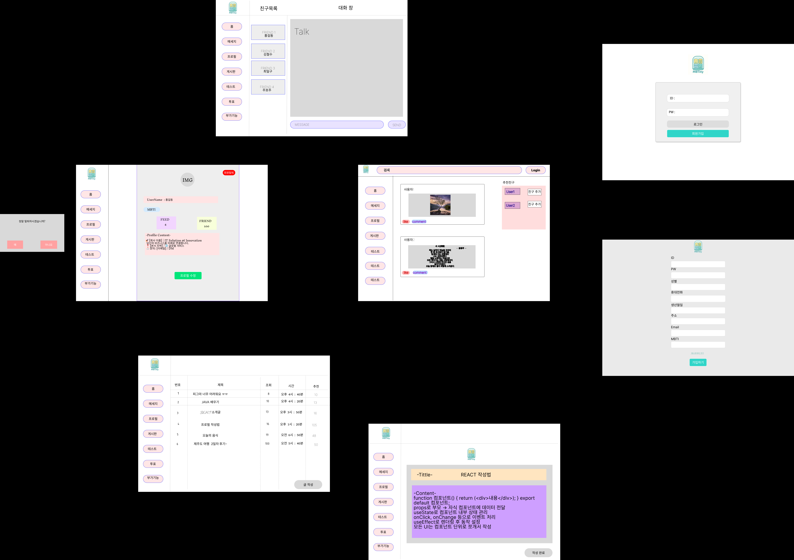
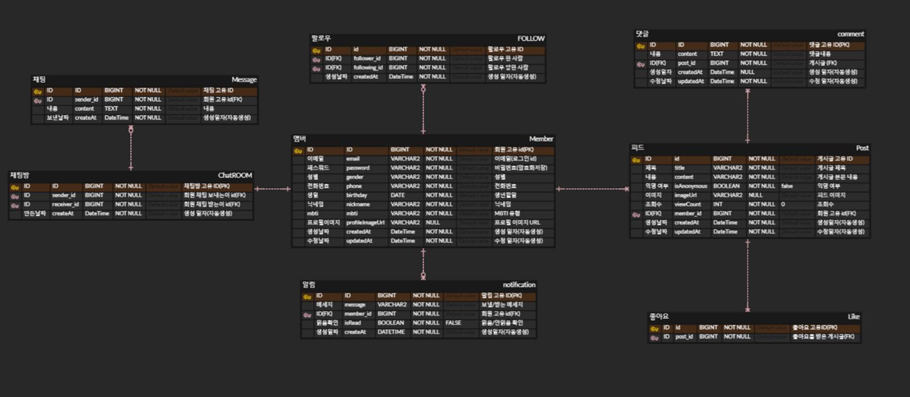

# Mb_Tiny

---

# 📌 프로젝트 소개

**MB-Tiny**는 MBTI를 기반으로 사람들이 자유롭게 소통하고 친구를 만들며, 정보를 나눌 수 있는 소셜 커뮤니티 플랫폼입니다.
성격 유형에 따른 소통 방식의 차이를 반영하여, 사용자 친화적인 인터페이스와 MBTI 맞춤형 피드를 제공합니다.

* 🔍 **주제**: MBTI 기반 커뮤니티 SNS 플랫폼
* 🧠 **기획의도**: MBTI를 통해 사람들과 공감하고 소통할 수 있는 공간 제공
* 🛠 기술스택: 
* * FE : React, React Router Dom, stompjs, event-source-polyfill
* * BE : Java, Spring boot 3, Spring Security, JPA, lombok, valid, MySQL, S3, SSE, WebSocket

---

## 👨‍👩‍👧‍👦 팀원 소개

| 이름  | 역할          | 담당 업무                                  |
| ----- | ------------- |----------------------------------------|
| 양제훈 | 팀장 / 백앤드 | 피드(게시판, 댓글, 좋아요), (언)팔로우, 알림기능, s3, 배포 |
| 홍성관 | 백엔드        | 회원가입, 로그인, 조회, 실시간 채팅 구현               |
| 정웅태 | 프론트엔드    | 친구추천, 회원가입, 익명게시판, 로그인(로그아웃), 탈퇴       |
| 조규훈 | 프론트엔드    | 메인, 프로필, 성격유형 테스트 페이지                |

---

## ✨ 주요 기능

### 📝 커뮤니티 (자유 게시판)

* 게시글 작성 / 수정 / 삭제
* 이미지 업로드 (AWS S3 연동)
* MBTI 필터로 피드 정렬
* 게시글 좋아요 / 댓글 작성

### 👤 사용자 기능

* 세션 기반 로그인 / 로그아웃
* 사용자 정보 조회
* 프로필 이미지 및 MBTI TEST
* MBTI 필터링을 통한 회원 추천
* 팔로우 언팔로우

### 📊 실시간 알림

* 댓글, 좋아요, 팔로우 실시간 알림 기능 구현

### 📊 실시간 채팅

* 웹소켓을 활용한 실시간 채팅 구현
---

## 🖥️ 서비스 화면

| 기능      | 화면                                    |
|---------|---------------------------------------|
| 메인 화면   |      |
| 프로필 화면  |    |
| MBTI 검사 |  |
| 채팅      |          |


---

## 🧱 아키텍처

```

```

## 🎨 Figma 화면 설계서

[Figma 링크 바로가기](https://www.figma.com/design/kOOAZRY3GNm1b0CzcuVEp9/%EC%A0%9C%EB%AA%A9-%EC%97%86%EC%9D%8C?node-id=0-1&p=f&t=JiMOw7mqcGQt9Z3c-0)



---

## 🗃 ERD




---

## ✅ 실행 방법

```bash
# backend
./gradlew build && java -jar build/libs/mbtiny.jar

# frontend
cd frontend
npm install
npm start
```


---

## 🙌 마무리

MB-Tiny는 단순한 MBTI 테스트를 넘어서, 사람들이 자신의 성향을 바탕으로 교류할 수 있는 공간을 목표로 만들어졌습니다. 다양한 피드백을 바탕으로 지속적인 개선을 이어나가겠습니다. 감사합니다! 🙏
